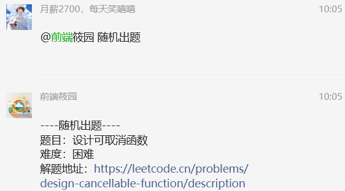

# 关于 co 的随想

今天看到群里随机出了一道题 —— 设计可取消函数。于是饶有兴致的点了进去。



[2650. 设计可取消函数 —— Leetcode ](https://leetcode.cn/problems/design-cancellable-function/description/)

题目的内容我就不去详细描述，感兴趣的朋友可以点击上面的题目链接进去查看。

让我比较感兴趣的是下面的评论 —— 实现多一个取消功能的 co


这个 `co` 模块曾有所耳闻，也在一些包里见过，但日常开发中未曾用过，并没有去深入了解这个玩意儿。

趁着这个契机，打算详细去了解一下。

## 异步写法的问题

近些年 web 前端大力发展，涌入大量前端从业人员。作为 web 前端的后来者们，可能很难理解为什么需要 `co` 这样的代码库。

但在没有 `async/await`，甚至是 `Promise` 都还需要 polyfill 的年代，JavaScript 代码中充满了回调函数。所谓的回调地狱也就是由于回调嵌套太深导致的：

```js
fs.readFile("file1.txt", function (err, data1) {
  if (err) throw err;
  fs.readFile("file2.txt", function (err, data2) {
    if (err) throw err;
    fs.readFile("file3.txt", function (err, data3) {
      if (err) throw err;
      // 处理数据
    });
  });
});
```

随着代码越来越多，中间夹杂的逻辑越来越复杂，代码就变得越来越难以维护了。

后来 `Promise` 使得这样的写法得到改善：

```js
const fs = require("fs").promises;

fs.readFile("file1.txt")
  .then((data1) => fs.readFile("file2.txt"))
  .then((data2) => fs.readFile("file3.txt"))
  .then((data3) => {
    // 处理数据
  })
  .catch((err) => {
    throw err;
  });
```

但 `Promise` 依然会有自己的问题，比如链式太长依然会导致代码可读性降低。

            回调和 Promise 本身没问题，只是同步的方式更符合人的思维。

## 能不能以同步的方式来编写异步代码？

虽然如今使用 `async/await` 能够很方便的用同步的方式编写异步代码，但在那个时候并不那么容易。

假设我们有这样的代码：

```js
fs.readFile("file1.txt", function (err, data1) {
  if (err) throw err;
  fs.readFile("file2.txt", function (err, data2) {
    if (err) throw err;
    fs.readFile("file3.txt", function (err, data3) {
      if (err) throw err;
      // 处理数据
    });
  });
});
```

要改成同步的方式，它应该像下面这样：

```js
try {
  const data1 = fs.readFile("file1.txt");
  const data2 = fs.readFile("file2.txt");
  const data3 = fs.readFile("file3.txt");
  // 处理数据
} catch (err) {
  throw err;
}
```

如何达到这样的效果呢？那就需要借助 `Generator`：

```js
function* task() {
  try {
    const data1 = yield readFile("file1.txt");
    const data2 = yield readFile("file2.txt");
    const data3 = yield readFile("file3.txt");
    // 处理数据
  } catch (err) {
    throw err;
  }
}
```

除了多了个 `*` 和 `yield`，它和我们预期的写法不能说是太像，简直就是一模一样！！！

这让我不由得想起了阮一峰老师在[《Generator 函数的含义与用法》](https://www.ruanyifeng.com/blog/2015/04/generator.html)中的一句话：

                异步编程的语法目标，就是怎样让它更像同步编程

`readFile` 会读取文件，但由于读取文件是异步的，所以它并不能立马返回文件内容，那要怎么做呢？

如果不能立马返回数据，那能不能返回一个闭包函数，当调用这个闭包函数就能处理回调数据。

但一开始不能立即执行异步操作。如果执行了异步操作，就必然需要传入回调函数，比如像下面这样一开始就执行了异步操作就没办法返回能处理数据的闭包函数：

```js
function readFile(file) {
  fs.readFile(file, (err, data) => {
    // 获得数据
  });
  return ??? // 如何返回能处理数据的回调函数
}
```

如果此时你觉得可以给 `readFile` 加一个 `callback` 参数就能完美的处理数据的话，那它和原来的 `fs.readFile` 有什么区别？最终也还是回调地狱 ...

所以也得把异步操作包到回调函数里面：

```js
function readFile(file) {
  return (callback) => {
    fs.readFile(file, callback);
  };
}
```

上面的方式实际上就是对 `fs.readFile` 进行了柯里化。

现在如果我们调用 `readFile` 得到的返回值就是一个函数，这个函数接受一个用于处理数据的回调函数，通过给它一个回调函数，就能够执行异步操作并处理数据，这在 JavaScript 中被称作 `thunk`，`co` 模块早期返回的就是 `thunk`，现在是 `Promise`，我们需要像下面这样来使用 `task`：

```js
const g = task();

const result1 = g.next(); // 执行到 readFile("file1.txt")，其中 result1.value 就是 readFile("file1.txt") 得到的回调函数

result1.value((err, data1) => {
  if (err) {
    g.throw(err);
    return;
  }

  const result2 = g.next(data1); // 将数据 data1 通过 g.next 传递给 task 内部的 data1，并执行 readFile("file2.txt")，result2.value 就是 readFile("file2.txt") 得到的回调函数

  result2.value((err, data2) => {
    if (err) {
      g.throw(err);
      return;
    }

    const result3 = g.next(data2); // 将数据 data2 通过 g.next 传递给 task 内部的 data2，并执行 readFile("file3.txt")，result3.value 就是 readFile("file3.txt") 得到的回调函数

    result3.value((err, data3) => {
      if (err) {
        g.throw(err);
        return;
      }

      g.next(data3); // 将数据 data3 通过 g.next 传递给 task 内部的 data3，并执行数据处理逻辑
    });
  });
});
```

这依然是个回调地狱，整个过程无非就是一直重复执行相同的操作，直到结束，那就可以把这个过程抽象出来：

```js
const g = task();

function next(err, data) {
  if (err) {
    g.throw(err);
    return;
  }

  const result = g.next(data);

  if (result.done) return;

  result.value(next);
}

next();
```

再抽象一下，把 task 改成 gen 作为参数，用函数包装起来：

```js
function co(gen) {
  const g = gen();

  function next(err, data) {
    if (err) {
      g.throw(err);
      return;
    }

    const result = g.next(data);

    if (result.done) return;

    result.value(next);
  }

  next();
}
```

这样就形成了一个最基础版本的 `co`，我们只需要像下面这样使用：

```js
co(function* task() {
  try {
    const data1 = yield readFile("file1.txt");
    const data2 = yield readFile("file2.txt");
    const data3 = yield readFile("file3.txt");
    // 处理数据
  } catch (err) {
    throw err;
  }
});
```

这样一来，是不是就更像同步的方式在编写异步代码了。

## 题外话

一开始我很难理解 `co` 的意义（即便是看到阮一峰老师相关文章开篇说到 **co 用于 Generator 函数的自动执行**，又或者 `co` 官方文档上第一句话：**让您以一种较好的方式编写非阻塞代码** ），明明可以用 `async/await` 却为什么非要历经千辛万苦写成 `Generator` 的方式然后用 `co` 来执行？

直到后来我看到 `co` 的提交时间才恍然大悟，它的最后一次提交代码是发生在 2015 年，距今（2024 年 7 月 30 日）已经 9 年有余了，而最早是在 2013 年，那个时候 Promise 还需要 polyfill，Nodejs 使用 Generator 还需要加 `--harmony-generators` 标志，而我才刚好还是大一，那是一个多么青涩的年代 ...

对于当下的环境来说，`co` 也算得上是一个过时的库了，就像当年的 jQuery，不得不感叹 —— 时代变了！

## 参考文档

- [co](https://github.com/tj/co)
- [thunks](https://github.com/thunks/thunks)
- [co 函数库的含义和用法](https://www.ruanyifeng.com/blog/2015/05/co.html)
